# 📊 Algorithm Flowcharts & Diagrams

Visual representations of complex algorithms using Mermaid diagrams.

---

## Quick Sort


---

## Dijkstra's Algorithm

```mermaid
graph TD
    A[Start: Graph + Source] --> B[Initialize distances to ∞]
    B --> C[Set source distance to 0]
    C --> D[Create priority queue]
    D --> E{Queue empty?}
    E -->|Yes| F[Return distances]
    E -->|No| G[Extract min distance node]
    G --> H{For each neighbor}
    H --> I[Calculate new distance]
    I --> J{New distance < current?}
    J -->|Yes| K[Update distance]
    J -->|No| H
    K --> L[Add to queue]
    L --> H
    H --> E
```



---

## Merge Sort


---

## Binary Search Tree Insert


---

## Dynamic Programming Pattern


---

## Breadth-First Search (BFS)


---

## Depth-First Search (DFS)


---

## Hash Table Operations


---

## KMP Pattern Matching

```mermaid
graph TD
    A[Start: Text + Pattern] --> B[Build LPS array]
    B --> C[Initialize i=0, j=0]
    C --> D{i < text length?}
    D -->|No| E[Pattern not found]
    D -->|Yes| F{text[i] == pattern[j]?}
    F -->|Yes| G[i++, j++]
    F -->|No| H{j != 0?}
    H -->|Yes| I[j = LPS[j-1]]
    H -->|No| J[i++]
    G --> K{j == pattern length?}
    K -->|Yes| L[Pattern found at i-j]
    K -->|No| D
    I --> D
    J --> D
```

---

## Topological Sort (Kahn's Algorithm)


---

## Decision Tree Training


---

## K-Means Clustering


---

## Knapsack Dynamic Programming

```mermaid
graph TD
    A[Start: Items + Capacity] --> B[Create DP table]
    B --> C[Initialize first row/column to 0]
    C --> D{For each item i}
    D --> E{For each capacity w}
    E --> F{Item weight <= w?}
    F -->|No| G[DP[i][w] = DP[i-1][w]]
    F -->|Yes| H[Calculate with/without item]
    H --> I[DP[i][w] = max of both]
    I --> E
    G --> E
    E --> D
    D --> J[Return DP[n][W]]
```

---

## Algorithm Complexity Comparison


---

## Data Structure Selection Guide


---

**Note:** These diagrams are rendered automatically on GitHub and in Markdown viewers that support Mermaid syntax.

**Last Updated:** October 2025  
**Maintained by:** Vitor Hansen
